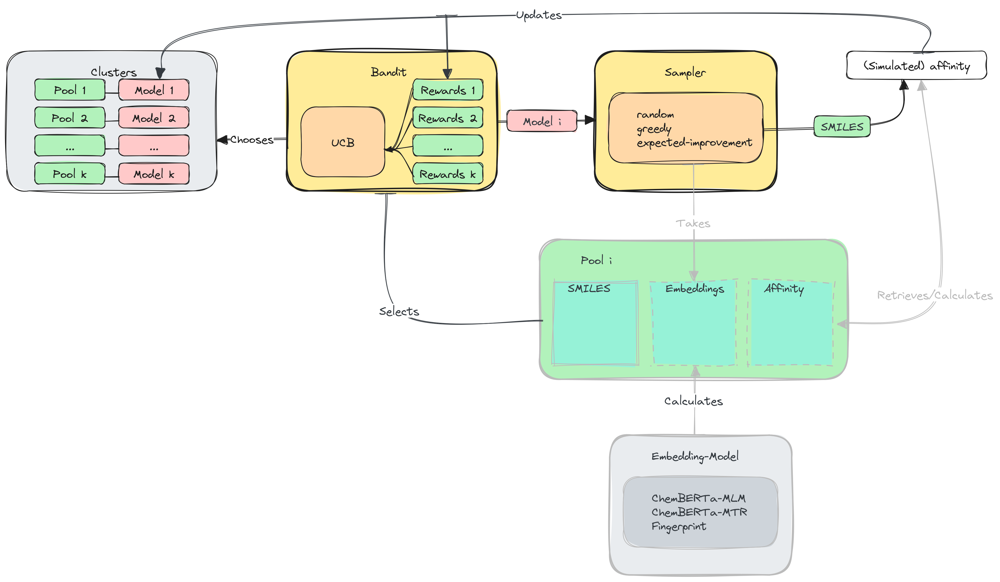
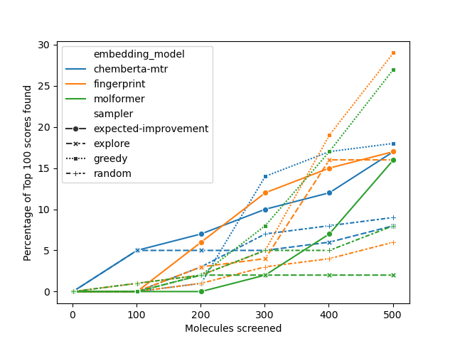
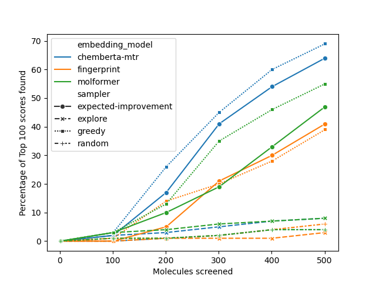

# Chemcial Language Models and Active Learning for identification of good binding ligands

In this work we use chemical language models, such as ChemBERTa and Molformer in combination with
Bayesian Optimization/Active learning to efficiently identify ligands with promising binding affinity for
a protein.

The rough process is described in the following figure. We employ a two-level approach.
Instead of directly optimizing the whole molecule pool, we first cluster the available molecules
using k-means and select promising clusters using a Multiarmed-Bandit.
In each iteration we select the most rewarding cluster and only then select the molecule with the
highest score according to bayesian optimization. <br>
The Multiarmed-Bandit selection can be seen as a coarse pruning of the input space, focusing on regions
where promising ligands have been observed.



<center>Results</center>

|  |  |
:-:|:---------------------------------:
| chembl203 |               4UNN                |

# Setup
Install the required python packages
```bash
conda env create -f environment.yml
```

We use [smina](https://sourceforge.net/projects/smina) for docking. For receptor preparation install
[ADFR suite](https://ccsb.scripps.edu/adfr) in a suitable place e.g. "~/.local/share"
```bash
cd $HOME/.local/share \
    && wget -O ADFRsuite.tar.gz https://ccsb.scripps.edu/adfr/download/1038/ \
    && tar -xzvf ADFRsuite.tar.gz \
    && cd ADFRsuite_* \
    && echo "Y" | ./install.sh -d . -c 0 \
    && cd .. \
    && rm -rf ADFRsuite.tar.gz
    && ln -s $HOME/.local/share/ADFRsuite_x86_64Linux_1.0/bin/prepare_receptor $HOME/.local/bin
```

Similarly, to install smina itself:
```bash
cd $HOME/.local/share \
    && wget -O smina https://sourceforge.net/projects/smina/files/smina.static/download \
    && chmod +x smina \
    && mv smina ../bin/
```

## Docker
Alternatively, build the provided docker image.
```bash
docker build --build-arg USER_ID=$UID --build-arg USER_NAME=$(id -n) -t protein_ligand:base -f Dockerfile .
```


Optionally install development packages:
```bash
conda install --file dev_requirements.txt
pre-commit install
```

# Run
Bayesian optimization can either be run on a dataset with precalculated docking scores or in an online fashion,
docking ligands using smina in each iteration.

More information about running can be found in the commandline interface.
Also, checkout ``scripts/compare_and_analyze.sh``.
```bash
export PYTHONPATH=$PYTHONPATH:.
conda run -n protein_ligand python experiments/run.py --help
```

The results will be stored in a sqlite database. When docking online, sdf files will
be stored in the user defined output directory. Each file contains the SMILES string of the ligand
md5 encoded, to avoid possible issues with the special characters appearing in the SMILES notation.

## Data
The ``data`` directory contains preprocessed files for the 5 proteins in ChEMBL with
the most recorded IC50 activity values, as well as the 10k and HTS collections from
David Graff's publication
[Accelerating high-throughput virtual screening through molecular pool-based active learning](http://xlink.rsc.org/?DOI=d0sc06805e).
